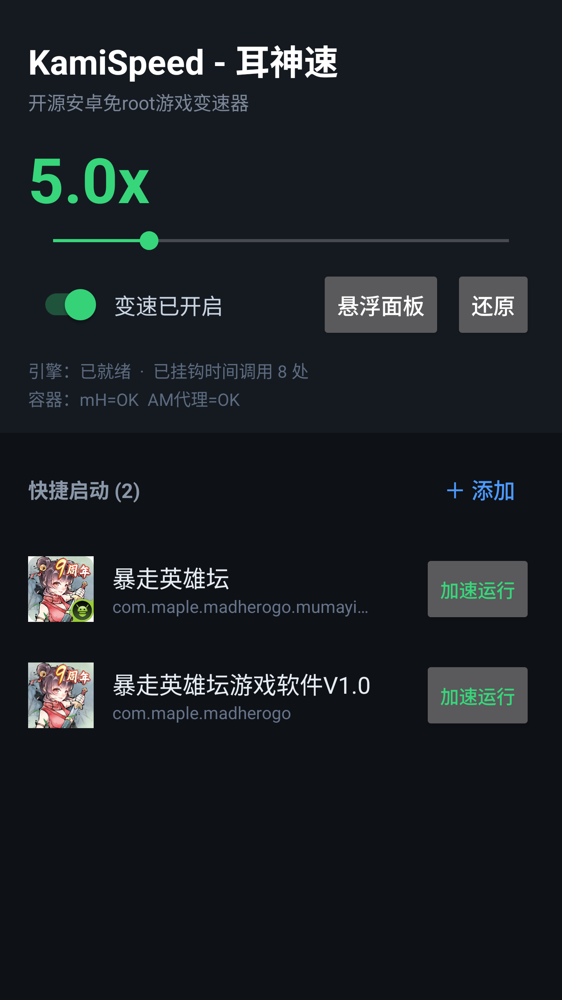

<p align="center">
  <a href="README.md">简体中文</a> | <a href="README.en.md">English</a>
</p>

# KamiSpeed - 耳神速

开源安卓免 root 游戏变速器，1x ~ 20x。

<p align="center">
  
</p>

## 功能

- **免 root**：基于虚拟容器技术，游戏跑在 KamiSpeed 自己的进程里，不改系统
- **1x ~ 20x 实时变速**：GOT/PLT 时间函数 Hook，拖动滑杆即时生效，时间轴全程连续不回跳
- **悬浮面板 / 半圆小球**：面板可拖动，✕ 收成吸附屏幕边缘的小球（字号自适应），点小球展开
- **兼容渠道 SDK**：访客的 Service / 自广播在进程内托管，渠道登录（U8 / TFY 等）可正常完成
- **快捷启动**：收藏常用游戏，一键以当前倍率启动

## 下载

- **项目主页**：[https://mimikami.github.io/KamiSpeed/](https://mimikami.github.io/KamiSpeed/)（GitHub Pages）
- **APK 直链**：`/KamiSpeed.apk`（主页同域，Cloudflare 托管）
- [Releases](https://github.com/Mimikami/KamiSpeed/releases) 查看历史版本

### 主页与自动同步

主页是纯静态页（`docs/`），可同时部署到 GitHub Pages 与 Cloudflare Pages：

1. **Cloudflare Pages 部署**：Cloudflare 控制台 → Workers & Pages → 创建 Pages → 连接本仓库 → 构建命令留空、输出目录填 `docs`。之后每次推送到 master 都会自动重新部署。
2. **APK 自动同步**：仓库内置 GitHub Action（`.github/workflows/sync-release-apk.yml`），每 6 小时检查一次最新 Release，把 APK 以固定文件名 `docs/KamiSpeed.apk` 拉入仓库并提交 —— 提交会触发 Pages 重新部署，主页下载按钮始终指向最新包。也可在 Actions 页手动 `Run workflow` 立即同步。

## 使用

1. 打开 KamiSpeed，勾选开关并拖动滑杆设置倍率（1.0x ~ 20.0x）
2. 「＋ 添加」把游戏加到主面板，点击启动
3. 悬浮面板在游戏内显示：滑杆 / 开关 / ± 实时调速；✕ 收成小球，点小球展开
4. 若游戏卡在渠道 SDK 的权限闸门页，长按快捷项选择真实游戏 Activity 启动

## 构建

环境：JDK 17、Android SDK (platform 34)、NDK、Gradle 8.7。

```bash
# 预编译 native 库（或使用已提交的 jniLibs 跳过此步）
./tools/build-native.ps1

# 打 Debug 包
gradle -PnativePrebuilt=true :app:assembleDebug
```

产物：`app/build/outputs/apk/debug/app-debug.apk`。

## 原理简述

- **容器**：只修改 ApplicationInfo（uid / dataDir），由 framework 原生构建 LoadedApk / ClassLoader / 资源；Activity 经宿主 Stub 启动后还原真实 intent / activityInfo
- **变速**：Hook 已加载模块对 libc 时间函数的 GOT 槽位，虚拟时间 `virtual = anchor + (real - anchor) * scale`；睡眠类调用按倍率反向缩放

## 已知限制

- 多进程组件（如独立进程下载服务）暂不支持
- 加速期间游戏本地时钟会快于真实时间（重启后归零），对局以服务器时间为准

## License

[GPL-3.0](LICENSE) —— 使用、修改、分发本项目源码必须保留版权与作者信息，衍生作品须以相同许可证开源。Copyright © 2026 Mimikami.
